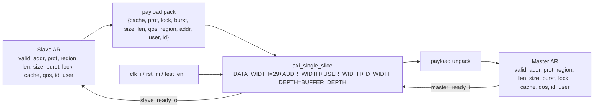

# `axi_ar_buffer.sv` 분석 문서

## 개요

`axi_ar_buffer`는 AXI4 Read Address(AR) 채널 전용 버퍼입니다. AR 채널 payload를 packed vector로 묶어 `axi_single_slice` FIFO에 저장하고, 출력 시 master 방향 AR 필드로 복원합니다.

## 파라미터

| 파라미터 | 설명 |
| --- | --- |
| `ID_WIDTH` | AXI ID 폭입니다. |
| `ADDR_WIDTH` | AXI 주소 폭입니다. |
| `USER_WIDTH` | AXI user sideband 폭입니다. |
| `BUFFER_DEPTH` | 내부 `axi_single_slice` FIFO 깊이입니다. |

## Payload Packing

AR payload 폭은 `29 + ADDR_WIDTH + USER_WIDTH + ID_WIDTH`이며, AW 채널과 동일한 address-channel 필드 묶음을 사용합니다.

| 필드 | 폭 |
| --- | ---: |
| `cache` | 4 |
| `prot` | 3 |
| `lock` | 1 |
| `burst` | 2 |
| `size` | 3 |
| `len` | 8 |
| `qos` | 4 |
| `region` | 4 |
| `addr` | `ADDR_WIDTH` |
| `user` | `USER_WIDTH` |
| `id` | `ID_WIDTH` |

## Block Diagram

## 동작 설명

- Slave 측 AR 요청은 `slave_valid_i & slave_ready_o` 조건에서 내부 FIFO로 push 됩니다.
- Master 측은 FIFO가 비어 있지 않을 때 `master_valid_o`를 통해 AR payload를 관찰합니다.
- Master가 `master_ready_i`를 asserted 하면 payload가 pop되고 다음 AR 요청으로 진행합니다.

## 계층 관계

- 하위 모듈: `axi_single_slice`
- 상위 사용처: `axi_slice`의 `ar_buffer_i`
