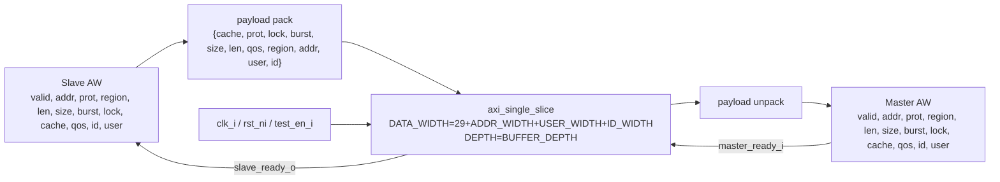

# `axi_aw_buffer.sv` 분석 문서

## 개요

`axi_aw_buffer`는 AXI4 Write Address(AW) 채널 전용 버퍼입니다. AW 채널의 모든 payload 필드를 하나의 packed vector로 결합하고, `axi_single_slice`를 통해 `valid/ready` 핸드셰이크 기반 FIFO 버퍼링을 수행한 후 master 방향 출력 필드로 다시 분해합니다.

## 파라미터

| 파라미터 | 설명 |
| --- | --- |
| `ID_WIDTH` | AXI ID 폭입니다. |
| `ADDR_WIDTH` | AXI 주소 폭입니다. |
| `USER_WIDTH` | AXI user sideband 폭입니다. |
| `BUFFER_DEPTH` | 내부 `axi_single_slice` FIFO 깊이입니다. |

## Payload Packing

AW payload 폭은 `29 + ADDR_WIDTH + USER_WIDTH + ID_WIDTH`입니다.

| 필드 | 폭 |
| --- | ---: |
| `cache` | 4 |
| `prot` | 3 |
| `lock` | 1 |
| `burst` | 2 |
| `size` | 3 |
| `len` | 8 |
| `qos` | 4 |
| `region` | 4 |
| `addr` | `ADDR_WIDTH` |
| `user` | `USER_WIDTH` |
| `id` | `ID_WIDTH` |

## Block Diagram

## 동작 설명

- Slave 측 AW 요청이 `slave_valid_i`와 `slave_ready_o`의 handshake로 수락됩니다.
- 수락된 AW payload는 필드 손실 없이 FIFO에 저장됩니다.
- Master 측 `master_ready_i`가 asserted 된 상태에서 `master_valid_o`가 asserted 되면 저장된 AW payload가 전달됩니다.
- `test_en_i`는 `axi_single_slice`의 `testmode_i`로 전달됩니다.

## 계층 관계

- 하위 모듈: `axi_single_slice`
- 상위 사용처: `axi_slice`의 `aw_buffer_i`
