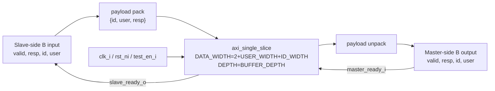

# `axi_b_buffer.sv` 분석 문서

## 개요

`axi_b_buffer`는 AXI4 Write Response(B) 채널 전용 버퍼입니다. B 채널의 `resp`, `id`, `user` payload를 `axi_single_slice`로 buffering합니다. B 채널은 write response가 downstream master interface에서 upstream slave interface 방향으로 되돌아오는 채널입니다.

## 파라미터

| 파라미터 | 설명 |
| --- | --- |
| `ID_WIDTH` | AXI ID 폭입니다. |
| `USER_WIDTH` | AXI user sideband 폭입니다. |
| `BUFFER_DEPTH` | 내부 FIFO 깊이입니다. |

## Payload Packing

B payload 폭은 `2 + USER_WIDTH + ID_WIDTH`입니다.

| 필드 | 폭 |
| --- | ---: |
| `id` | `ID_WIDTH` |
| `user` | `USER_WIDTH` |
| `resp` | 2 |

## Block Diagram

## 동작 설명

- Write response는 `slave_valid_i & slave_ready_o`에서 FIFO에 push 됩니다.
- FIFO가 비어 있지 않으면 `master_valid_o`가 asserted 되고, `master_ready_i`와 handshake되면 pop 됩니다.
- `axi_slice` 내에서는 B channel response 방향 때문에 downstream AXI master의 B 입력이 이 모듈의 slave 입력에 연결되고, upstream AXI slave의 B 출력이 이 모듈의 master 출력에 연결됩니다.

## 계층 관계

- 하위 모듈: `axi_single_slice`
- 상위 사용처: `axi_slice`의 `b_buffer_i`
