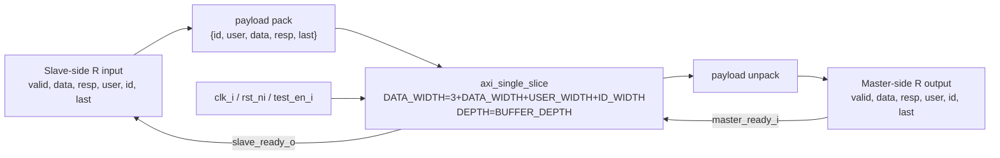

# `axi_r_buffer.sv` 분석 문서

## 개요

`axi_r_buffer`는 AXI4 Read Data(R) 채널 전용 버퍼입니다. R 채널은 AXI master 쪽에서 slave 쪽으로 되돌아오는 response/data 채널이므로, `axi_slice` 상위 계층에서는 downstream master interface의 R 입력을 이 버퍼의 slave 입력으로 넣고 upstream slave interface의 R 출력으로 내보냅니다.

## 파라미터

| 파라미터 | 설명 |
| --- | --- |
| `ID_WIDTH` | AXI ID 폭입니다. 기본값은 4입니다. |
| `DATA_WIDTH` | AXI read data 폭입니다. 기본값은 64입니다. |
| `USER_WIDTH` | AXI user sideband 폭입니다. 기본값은 6입니다. |
| `BUFFER_DEPTH` | 내부 FIFO 깊이입니다. 기본값은 8입니다. |
| `STRB_WIDTH` | `DATA_WIDTH/8`로 정의되지만 이 모듈 내부 payload에는 사용되지 않습니다. |

## Payload Packing

R payload 폭은 `3 + DATA_WIDTH + USER_WIDTH + ID_WIDTH`입니다.

| 필드 | 폭 |
| --- | ---: |
| `id` | `ID_WIDTH` |
| `user` | `USER_WIDTH` |
| `data` | `DATA_WIDTH` |
| `resp` | 2 |
| `last` | 1 |

## Block Diagram

## 동작 설명

- Read response beat 단위로 buffering합니다.
- `resp`, `id`, `user`, `last`가 데이터와 함께 FIFO에 저장되어 response 순서와 burst 종료 정보가 보존됩니다.
- `axi_slice` 내에서는 AXI read response 방향 때문에 포트 명명상의 slave/master 방향이 전체 AXI master/slave 포트 방향과 반대로 연결됩니다.

## 계층 관계

- 하위 모듈: `axi_single_slice`
- 상위 사용처: `axi_slice`의 `r_buffer_i`
