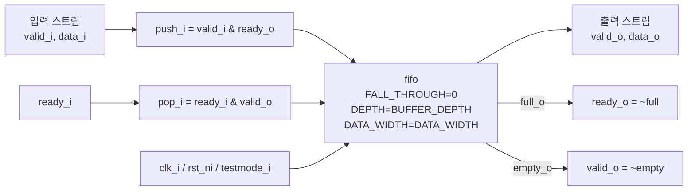

# `axi_single_slice.sv` 분석 문서

## 개요

`axi_single_slice`는 `valid/ready` 스트리밍 인터페이스 한 개를 외부 `fifo` 모듈로 버퍼링하는 공통 래퍼입니다. AXI 채널별 버퍼들은 각 채널의 payload를 하나의 packed vector로 묶은 뒤 이 모듈을 통해 FIFO에 저장하고, 출력 측에서 다시 필드로 분해합니다.

## 파라미터

| 파라미터 | 설명 |
| --- | --- |
| `BUFFER_DEPTH` | 내부 FIFO 깊이입니다. |
| `DATA_WIDTH` | FIFO에 저장할 payload vector 폭입니다. |

## 포트 요약

| 포트 | 방향 | 설명 |
| --- | --- | --- |
| `clk_i` | input | 동기 클록입니다. |
| `rst_ni` | input | active-low 비동기 리셋입니다. |
| `testmode_i` | input | 하위 `fifo`의 test mode 입력으로 전달됩니다. |
| `valid_i`, `ready_o`, `data_i` | input/output | 입력 측 valid/ready/data 인터페이스입니다. |
| `ready_i`, `valid_o`, `data_o` | input/output | 출력 측 ready/valid/data 인터페이스입니다. |

## Block Diagram

## 동작 설명

- `ready_o`는 FIFO가 full이 아닐 때 asserted 됩니다.
- `valid_o`는 FIFO가 empty가 아닐 때 asserted 됩니다.
- 입력 전송은 `valid_i & ready_o`일 때 FIFO push로 변환됩니다.
- 출력 전송은 `ready_i & valid_o`일 때 FIFO pop으로 변환됩니다.
- `FALL_THROUGH`가 `1'b0`으로 고정되어 있으므로, FIFO 구현 기준으로 fall-through가 비활성화된 등록형 slice로 동작합니다.

## 의존 모듈

- `fifo`: 이 파일 내부에는 정의되어 있지 않으며, 같은 프로젝트 또는 외부 IP로 제공되어야 합니다.
