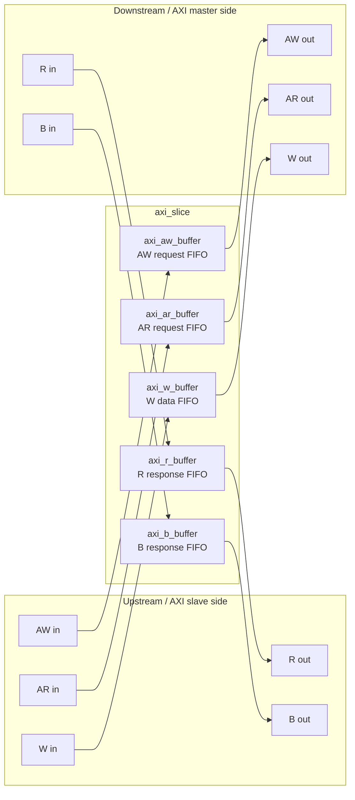

# `axi_slice.sv` 분석 문서

## 개요

`axi_slice`는 AXI4 인터페이스의 5개 독립 채널(AW, AR, W, R, B)에 각각 FIFO 기반 slice를 삽입하는 상위 모듈입니다. 요청 방향 채널(AW, AR, W)은 upstream slave 포트에서 downstream master 포트로 전달되고, 응답 방향 채널(R, B)은 downstream master 포트에서 upstream slave 포트로 되돌아옵니다.

## 파라미터

| 파라미터 | 설명 |
| --- | --- |
| `AXI_ADDR_WIDTH` | AXI 주소 폭입니다. 기본값 32입니다. |
| `AXI_DATA_WIDTH` | AXI data 폭입니다. 기본값 64입니다. |
| `AXI_USER_WIDTH` | AXI user sideband 폭입니다. 기본값 6입니다. |
| `AXI_ID_WIDTH` | AXI ID 폭입니다. 기본값 3입니다. |
| `SLICE_DEPTH` | 각 채널 slice의 FIFO 깊이입니다. 기본값 2입니다. |
| `AXI_STRB_WIDTH` | write strobe 폭이며 `AXI_DATA_WIDTH/8`입니다. |

## Block Diagram

## 채널별 연결 요약

| AXI 채널 | 하위 버퍼 | 데이터 흐름 | 주요 payload |
| --- | --- | --- | --- |
| AW | `axi_aw_buffer` | `axi_slave_*` → `axi_master_*` | write address/control/id/user |
| AR | `axi_ar_buffer` | `axi_slave_*` → `axi_master_*` | read address/control/id/user |
| W | `axi_w_buffer` | `axi_slave_*` → `axi_master_*` | write data/strb/user/last |
| R | `axi_r_buffer` | `axi_master_*` → `axi_slave_*` | read data/resp/id/user/last |
| B | `axi_b_buffer` | `axi_master_*` → `axi_slave_*` | write resp/id/user |

## 동작 설명

- 각 AXI 채널은 독립적인 `valid/ready` handshake와 독립적인 FIFO를 갖습니다.
- `SLICE_DEPTH`는 모든 채널 버퍼의 `BUFFER_DEPTH`로 전달됩니다.
- `clk_i`, `rst_ni`, `test_en_i`는 모든 하위 채널 버퍼로 공통 전달됩니다.
- AW/AR/W 채널에는 요청 방향 backpressure가 적용되고, R/B 채널에는 응답 방향 backpressure가 적용됩니다.
- 채널 간 ordering이나 transaction scoreboard는 이 모듈에서 추가로 구현하지 않으며, 각 채널 payload를 FIFO 순서대로 지연/완충하는 역할에 집중합니다.

## 하위 모듈 인스턴스

| 인스턴스 | 모듈 | 역할 |
| --- | --- | --- |
| `aw_buffer_i` | `axi_aw_buffer` | write address 채널 버퍼 |
| `ar_buffer_i` | `axi_ar_buffer` | read address 채널 버퍼 |
| `w_buffer_i` | `axi_w_buffer` | write data 채널 버퍼 |
| `r_buffer_i` | `axi_r_buffer` | read data/response 채널 버퍼 |
| `b_buffer_i` | `axi_b_buffer` | write response 채널 버퍼 |

## 사용 시 주의사항

- `fifo` 구현이 빌드 환경에 포함되어야 합니다.
- `SLICE_DEPTH`와 각 폭 파라미터는 하위 버퍼의 packed payload 폭 계산에 직접 영향을 줍니다.
