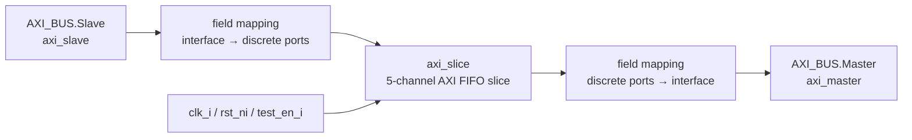

# `axi_slice_wrap.sv` 분석 문서

## 개요

`axi_slice_wrap`은 bundle/interface 형태의 `AXI_BUS` 포트를 discrete signal 포트를 사용하는 `axi_slice`에 연결하는 래퍼입니다. 기능적 buffering은 하위 `axi_slice`가 수행하며, 이 모듈은 `AXI_BUS.Slave`와 `AXI_BUS.Master` modport의 필드를 `axi_slice` 포트에 매핑합니다.

## 파라미터

| 파라미터 | 설명 |
| --- | --- |
| `AXI_ADDR_WIDTH` | AXI 주소 폭입니다. |
| `AXI_DATA_WIDTH` | AXI data 폭입니다. |
| `AXI_USER_WIDTH` | AXI user sideband 폭입니다. |
| `AXI_ID_WIDTH` | AXI ID 폭입니다. |
| `SLICE_DEPTH` | 하위 `axi_slice`의 채널 FIFO 깊이입니다. |
| `AXI_STRB_WIDTH` | write strobe 폭이며 `AXI_DATA_WIDTH/8`입니다. |

## Block Diagram

## 포트 및 연결 특성

- `axi_slave`는 upstream 쪽 AXI slave modport입니다.
- `axi_master`는 downstream 쪽 AXI master modport입니다.
- AW, AR, W 요청 채널은 `axi_slave` 필드에서 `axi_master` 필드로 전달됩니다.
- R, B 응답 채널은 `axi_master` 필드에서 `axi_slave` 필드로 전달됩니다.
- 마지막의 `.*` 연결은 명시 연결되지 않은 동일 이름 포트(`clk_i`, `rst_ni`, `test_en_i`)를 하위 `axi_slice`에 연결하는 용도입니다.

## 동작 설명

- 래퍼 자체에는 별도의 상태나 조합 로직이 없습니다.
- 모든 파라미터는 같은 이름으로 `axi_slice`에 전달됩니다.
- `AXI_BUS` interface 정의가 컴파일 환경에 포함되어 있어야 합니다.

## 의존 모듈/타입

- `axi_slice`
- `AXI_BUS` interface 및 `Slave`, `Master` modport 정의
