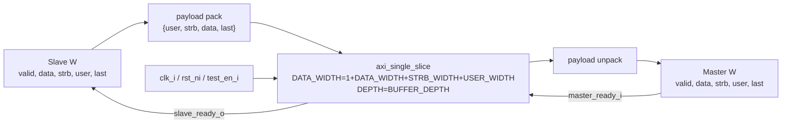

# `axi_w_buffer.sv` 분석 문서

## 개요

`axi_w_buffer`는 AXI4 Write Data(W) 채널 전용 버퍼입니다. W 채널의 `data`, `strb`, `user`, `last`를 packed vector로 묶어 `axi_single_slice`에 저장하고, master 방향으로 동일한 payload와 handshake를 제공합니다.

## 파라미터

| 파라미터 | 설명 |
| --- | --- |
| `DATA_WIDTH` | AXI write data 폭입니다. |
| `USER_WIDTH` | AXI user sideband 폭입니다. |
| `BUFFER_DEPTH` | 내부 FIFO 깊이입니다. |
| `STRB_WIDTH` | byte strobe 폭이며 기본값은 `DATA_WIDTH/8`입니다. 주석상 override하지 않는 값입니다. |

## Payload Packing

W payload 폭은 `1 + DATA_WIDTH + STRB_WIDTH + USER_WIDTH`입니다.

| 필드 | 폭 |
| --- | ---: |
| `user` | `USER_WIDTH` |
| `strb` | `STRB_WIDTH` |
| `data` | `DATA_WIDTH` |
| `last` | 1 |

## Block Diagram

## 동작 설명

- Write data beat 단위로 buffering합니다.
- `last`도 payload에 포함되므로 burst의 마지막 beat 정보가 데이터와 함께 보존됩니다.
- backpressure는 FIFO full 여부와 master ready에 따라 표준 valid/ready 방식으로 전달됩니다.

## 계층 관계

- 하위 모듈: `axi_single_slice`
- 상위 사용처: `axi_slice`의 `w_buffer_i`
